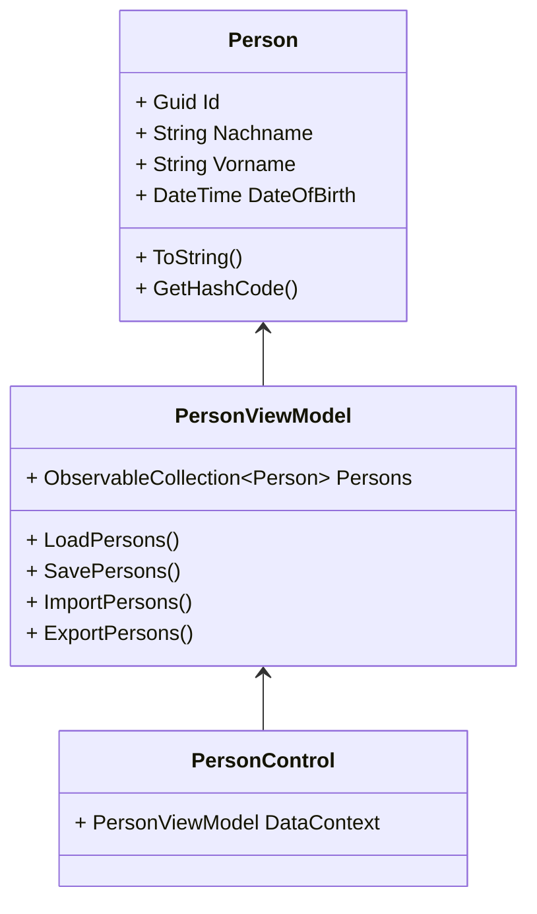

```mermaid
classDiagram

    class Person {

        + Guid Id
        + String Nachname
        + String Vorname
        + DateTime DateOfBirth

        + ToString()
        + GetHashCode()
    }

    class PersonViewModel {

        + ObservableCollection~Person~ Persons

        + LoadPersons()
        + SavePersons()

        + ImportPersons()
        + ExportPersons()
    }
    
    class PersonControl {

        + PersonViewModel DataContext
    }

    Person <-- PersonViewModel
    PersonViewModel <-- PersonControl
```